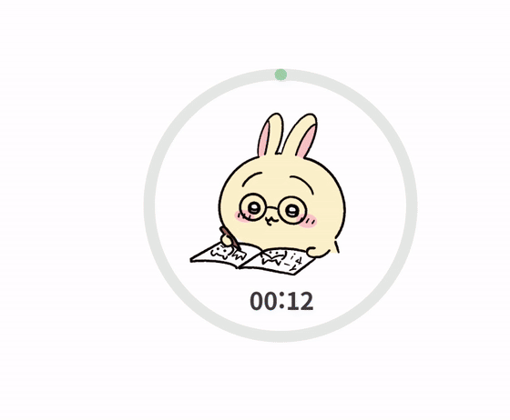

# 치이카와 타이머 3종

### 책상 위 작은 친구들과, 오늘도 한 페이지 📖

치이카와 · 하치와레 · 우사기가 함께 공부하고 
타이머가 끝나면 노래와 공연으로 집중한 시간을 축하해요.

**[📦 배포 파일 다운로드](chiikawa_timer_python_소스배포용.zip?raw=true)**

---

## 🤍 치이카와

안경을 쓰고 꼬박꼬박 공부하다가, 집중을 마치면 신나는 파티가 시작돼요.

<table>
  <tr><th>공부 모션</th><th>타이머 종료 모션</th></tr>
  <tr>
    <td align="center"></td>
    <td align="center"></td>
  </tr>
</table>

🎵 **완료 노래: 파자마 파티즈** · 27초 
[음악 원본 보기 ↗](https://www.youtube.com/watch?v=rZcich2neds&t=5s)

## 🩵 하치와레

나란히 공부해 주는 든든한 친구. 끝까지 집중했다면 하치와레의 노래를 들어 보세요.

<table>
  <tr><th>공부 모션</th><th>타이머 종료 모션</th></tr>
  <tr>
    <td align="center"></td>
    <td align="center"></td>
  </tr>
</table>

🎵 **완료 노래: 혼잣말** · 57초 
[음악 원본 보기 ↗](https://www.youtube.com/watch?v=GKC1P0mCt4o)

## 💛 우사기

공부할 때는 진지하게, 끝날 때는 우사기답게! 마지막은 신나는 우사기 랩으로 마무리해요.

<table>
  <tr><th>공부 모션</th><th>타이머 종료 모션</th></tr>
  <tr>
    <td align="center"></td>
    <td align="center"></td>
  </tr>
</table>

🎵 **완료 노래: 우사기 랩** · 16초 
[음악 원본 보기 ↗](https://www.youtube.com/watch?v=fecqNKavDWE&t=21s)

GIF에는 소리가 없습니다. 실제 프로그램에서는 완료 노래 설정을 켜면 캐릭터별 음악이 재생됩니다.

---

## 🧜 세이렌이 한 바퀴 도는 동안, 집중!

  

타이머를 설정하면 공부하는 캐릭터 주변에 원과 남은 시간이 나타나요. 세이렌과 인어 두 마리가 원을 따라 한 바퀴 도는 동안, 해야 할 일에 집중해 보세요.

시간이 흐를수록 타이머가 빨간색으로 바뀌고, 시간이 다 되면 세이렌과 인어들이 물러나요. 원과 시간 표시도 사라지고, 캐릭터의 축하 공연이 시작됩니다. 위 GIF는 12초 체험으로 촬영한 시연이에요.

| 기능 | 이렇게 사용해요 |
| :--- | :--- |
| 집중 시간 | 15분 · 30분 · 60분 또는 커스텀 1~180분 |
| 잠깐 쉬기 | 타이머 실행 중 우클릭 → 타이머 설정 → 일시정지 |
| 타이머 해제 | 타이머 실행 중 우클릭 → 타이머 설정 → 타이머 해제 |
| 세이렌·음악 | 타이머 설정에서 각각 켜거나 끌 수 있어요 |
| 캐릭터 선택 | 우클릭 → 캐릭터 설정 → 치이카와 / 하치와레 / 우사기 |
| 원하는 위치로 | 캐릭터를 드래그하면 원과 시간도 함께 이동해요 |

## 📦 다운로드 & 사용법

1. **[배포 ZIP](chiikawa_timer_python_소스배포용.zip?raw=true)**에서 `chiikawa_timer_python_소스배포용.zip`을 다운로드하세요.
2. ZIP **전체를 압축 해제**하세요.
3. Python 3.10 이상을 설치하고, 프로그램 폴더에서 `py -m pip install -r requirements.txt`를 한 번 실행하세요.
4. 폴더 안의 **`실행.bat`**을 실행하세요. 검은 창은 닫히고 타이머만 계속 실행됩니다.
5. 캐릭터를 **우클릭 → 타이머 설정 → 원하는 시간**을 선택하면 바로 시작돼요.

코드 파일과 `assets` 폴더는 함께 두세요. 프로그램을 끝내려면 타이머 설정의 `종료` 버튼 또는 알림 영역의 종료 메뉴를 사용하세요. 자세한 설치 안내는 압축 파일 안의 `README.md`에서 확인할 수 있어요.

Windows 실행 안내

Windows 64비트용 Python 소스 배포본입니다. Python과 Qt 라이브러리에도 PC의 실행 정책이 적용되므로 모든 환경에서 경고 없이 실행되는 것은 보장하지 않습니다.

---

자료 출처 · 제작 안내

- 개인 팬 제작·수정본으로, 공식 치이카와 제품이 아닙니다.
- 원본 데스크톱 펫: [CookieElmo](https://cookieelmo.itch.io/desktop-chiikawa)
- 우사기 도트: [chiikawa-dots-pets](https://github.com/heelee912/chiikawa-dots-pets)
- 치이카와 캐릭터: nagano
- 세이렌·인어: AI 팬 일러스트
- GIF: 프로젝트의 브라우저 시연 영상에서 추출
- 구현: Python + PySide6 · 글꼴: Pretendard
- 음악 출처와 라이선스는 배포본의 `자료 출처.txt` 및 동봉된 라이선스 파일을 확인하세요.

  작은 친구들과 함께, 오늘의 집중도 차곡차곡 🌱

